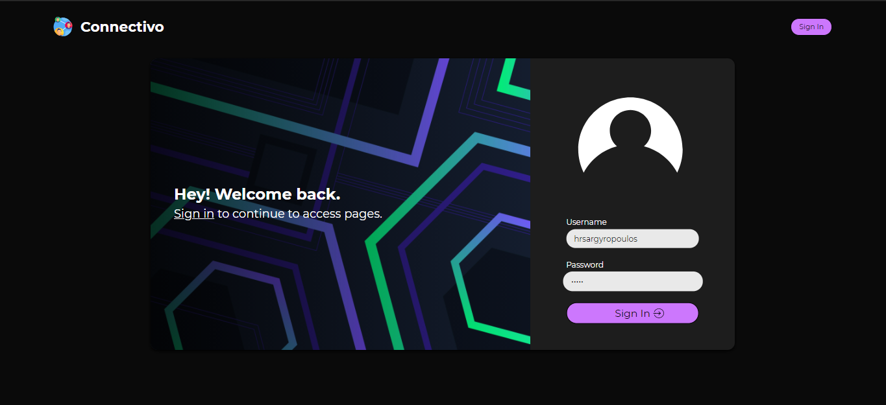
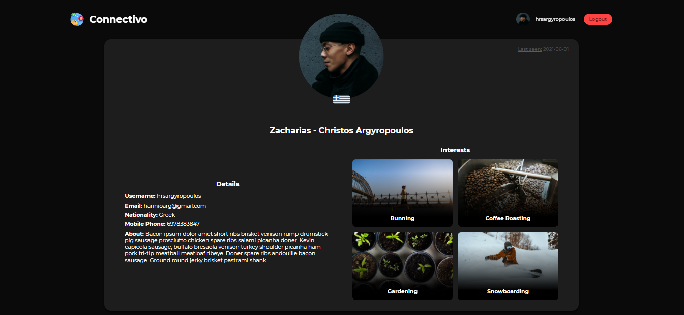
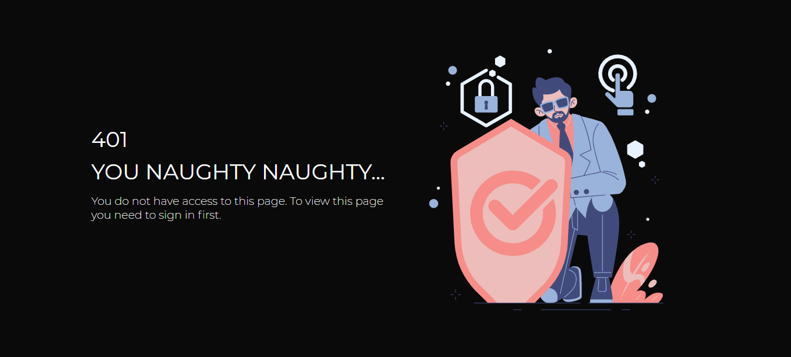

<h1>Flask Login System (w/ Jinja Template Engine)</h1>

>GitHub Repo: <https://github.com/HRSArgyropoulos/FlaskAssignment>

>Application on my domain: <https://hrsargyropoulos.com/login-system-flask/>

<h2>Details</h2>

- All templates are custom and have been created from scratch with HTML and CSS.
- When you successfully sign in you will be redirected to the homepage, unless you had previously visited the profile view with your username, thus you will be redirected there.
- The flaskenv and DB for the purpose of this assignment is also provided.
- There are 2 base templates. One main for the login, home and profile templates (_layout.html) and one for the error pages (_error_layout.html).
- Cookies and Session have been set to be permanent (even if you close the browser) and the expiry date is set to 10 minutes.

<h2>Credentials</h2>

| Username        | Password    |
| --------------- |:-----------:|
| noah_tremblay01 | noah123     |
| hrsargyropoulos | haris       |

<br>

<h2>How to run project locally</h2>

- Clone this repo
- Run ```python -m venv .venv``` to create .venv folder
- Run ```.\.venv\Scripts\activate``` to activate venv environment
- Run ```pip install -r .\requirements.txt``` to install all project requirements
- Run ```flask run```
- Open http://localhost:5000/ in the browser

<h2>Preview</h2>






<small>All rights reserved except for images, graphics, icons, svgs.</small>
